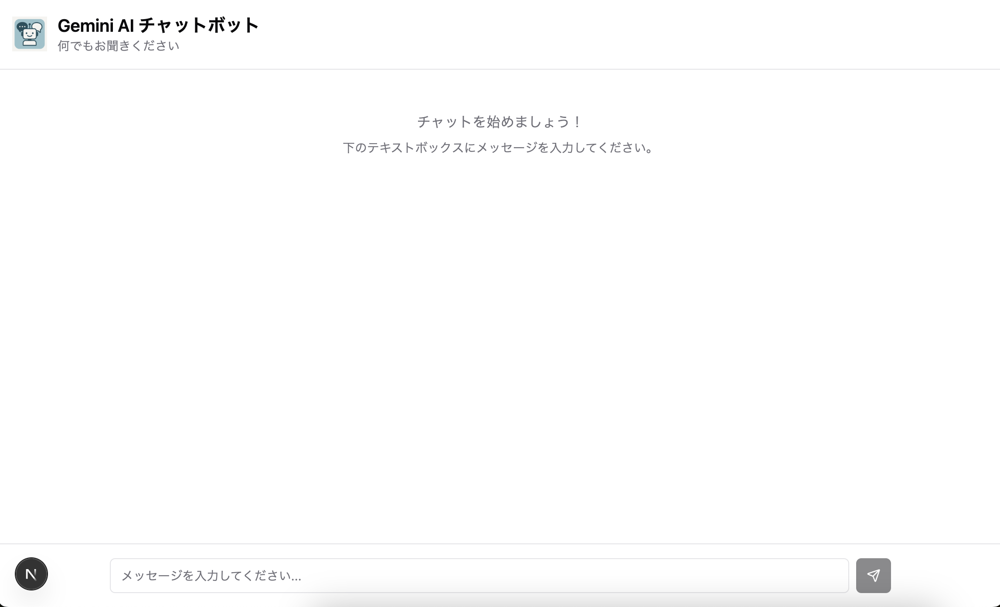
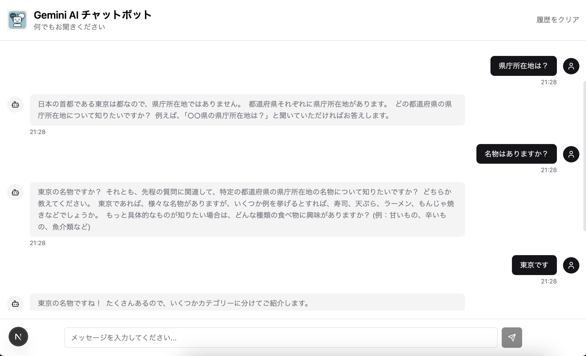

# 対話型AI bot

AIチャットボットアプリケーション。自然な日本語での対話が可能で、会話履歴を保持した文脈理解型の対話を実現します。

## 📱 アプリケーション画面

### メイン画面


### チャット機能


## 🚀 主な機能

- **リアルタイムチャット**: 高速応答
- **会話履歴保持**: 文脈を理解した継続的な対話
- **レスポンシブデザイン**: デスクトップ・モバイル対応
- **SSR対応**: 高速な初期ページロードとSEO最適化
- **エラーハンドリング**: 堅牢なエラー処理機能
- **タイプセーフ**: TypeScriptによる型安全性

## 🛠️ 技術スタック

### フロントエンド
- **Next.js 15** (App Router)
- **React 19**
- **TypeScript**
- **Tailwind CSS**
- **Zustand** (状態管理)
- **Radix UI** (UIコンポーネント)
- **Lucide React** (アイコン)

### バックエンド
- **Next.js API Routes**

### 開発環境
- **PostCSS**
- **Autoprefixer**
- **Tailwindcss-animate**

## 📁 プロジェクト構成

```
ai-bot/
├── app/                    # Next.js App Router
│   ├── api/
│   │   └── chat/          # チャットAPI エンドポイント
│   ├── globals.css        # グローバルスタイル
│   ├── layout.tsx         # ルートレイアウト
│   └── page.tsx           # ホームページ
├── components/            # 共通UIコンポーネント
│   └── ui/               
├── features/              # 機能単位のコンポーネント
│   └── chat/
│       ├── Chat.container.tsx      # コンテナコンポーネント
│       ├── Chat.presentational.tsx # プレゼンテーショナルコンポーネント
│       ├── Chat.use.ts            # カスタムフック
│       └── components/            # チャット関連コンポーネント
├── lib/                   # ユーティリティ関数
│   ├── gemini.ts         # Gemini API統合
│   └── utils.ts          # 汎用ユーティリティ
├── store/                 # 状態管理
│   └── chat.store.ts     # チャット状態管理
├── types/                 # 型定義
│   └── chat.type.ts      # チャット関連型
└── public/               # 静的ファイル
    └── logo.png          # アプリケーションロゴ
```
